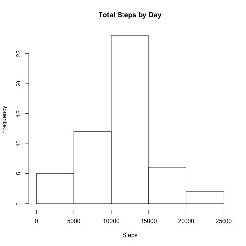
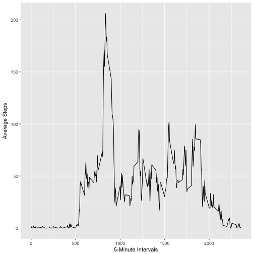
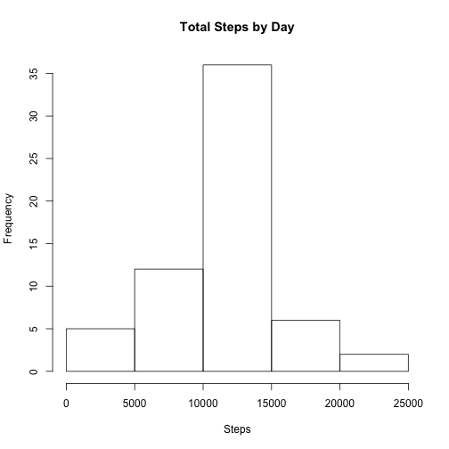
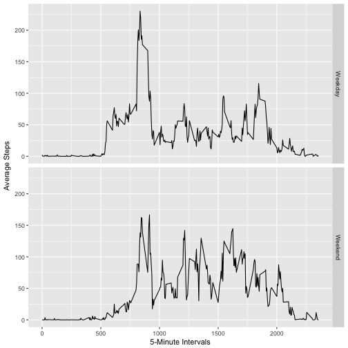

Movement Analysis
========================

This doc analyzes the personal movement data taken at random from a personal activity monitoring device.

##Loading and preprocessing the data

Here we will setup libraries and load in the data


```r
library(ggplot2)
library(plyr)

fileUrl <- "https://d396qusza40orc.cloudfront.net/repdata%2Fdata%2Factivity.zip"
actmonData <- tempfile()
download.file(url=fileUrl, destfile = actmonData, method = 'curl')
amData <- read.csv(unz(actmonData, "activity.csv"), stringsAsFactors = FALSE)
unlink(actmonData)

head(amData)
```

```
##   steps       date interval
## 1    NA 2012-10-01        0
## 2    NA 2012-10-01        5
## 3    NA 2012-10-01       10
## 4    NA 2012-10-01       15
## 5    NA 2012-10-01       20
## 6    NA 2012-10-01       25
```

Bit of data processing to create day and dateTime fields for easier analysis down the road.


```r
amData$day <- weekdays(as.Date(amData$date))
amData$dateTime <- as.POSIXct(amData$date, format="%Y-%m-%d")
```

##What is mean total number of steps taken per day?

Quick look at the number of steps per day by this individual.


```r
stepsSub <- aggregate(amData$steps ~ amData$dateTime, FUN = sum)
colnames(stepsSub) <- c("Date", "Steps")
hist(stepsSub$Steps, main = "Total Steps by Day", xlab = "Steps")
```



The mean and median number of steps taken:


```r
mean(stepsSub$Steps)
```

```
## [1] 10766.19
```

```r
median(stepsSub$Steps)
```

```
## [1] 10765
```

##What is the average daily activity pattern?

A plot of the average number of steps taken over time:


```r
##average number of steps per 5-minute interval
stepAverages <- aggregate(amData$steps, by=list(amData$interval), FUN=mean, na.rm=TRUE)
colnames(stepAverages) <- c("interval", "steps")

ggplot(data = stepAverages, aes(interval, steps)) + geom_line() + xlab("5-Minute Intervals") + ylab("Average Steps")
```



The 5-minute interval that, on average, contains the maximum number of steps


```r
max(stepAverages$steps, na.rm = TRUE)
```

```
## [1] 206.1698
```

##Imputing missing values

Number of NAs in the data

```r
sum(rowSums(is.na(amData)))
```

```
## [1] 2304
```

There are 2,304 missing values. We'll fill in the NAs with the 5 minute interval averages from the previous table.

```r
imputed <- amData

for (i in 1:nrow(imputed)){
  if (is.na(imputed$steps[i])){
    imputed$steps[i] <- stepAverages$steps[which(imputed$interval[i] == stepAverages$interval)]}
}

imputed <- arrange(imputed, interval)

##Check for NA values in the new set
sum(rowSums(is.na(imputed)))
```

```
## [1] 0
```

Reproducing the steps per day model, but now with the missing data filled in.


```r
stepsSub2 <- aggregate(imputed$steps ~ imputed$dateTime, FUN = sum)
colnames(stepsSub2) <- c("Date", "Steps")
hist(stepsSub2$Steps, main = "Total Steps by Day", xlab = "Steps")
```



##Are there differences in activity patterns between weekdays and weekends?

Create a new factor variable in the dataset with two levels – “weekday” and “weekend” indicating whether a given date is a weekday or weekend day.

```r
imputed$dayType <- ifelse(imputed$day %in% c("Saturday", "Sunday"), "Weekend", "Weekday")
head(imputed)
```

```
##       steps       date interval       day   dateTime dayType
## 1  1.716981 2012-10-01        0    Monday 2012-10-01 Weekday
## 2  0.000000 2012-10-02        0   Tuesday 2012-10-02 Weekday
## 3  0.000000 2012-10-03        0 Wednesday 2012-10-03 Weekday
## 4 47.000000 2012-10-04        0  Thursday 2012-10-04 Weekday
## 5  0.000000 2012-10-05        0    Friday 2012-10-05 Weekday
## 6  0.000000 2012-10-06        0  Saturday 2012-10-06 Weekend
```

Average number of steps taken per 5-minute interval across weekdays and weekends

```r
##average steps by interval and day type (weekend or weekday)
stepAverages2 <- aggregate(imputed$steps, by=list(imputed$interval, imputed$dayType), FUN=mean, na.rm=TRUE)
colnames(stepAverages2) <- c("interval", "dayType", "steps")

##plotting averages by day type
ggplot(data = stepAverages2, aes(interval, steps)) + geom_line() + facet_grid(dayType ~ .) + xlab("5-Minute Intervals") + ylab("Average Steps")
```




